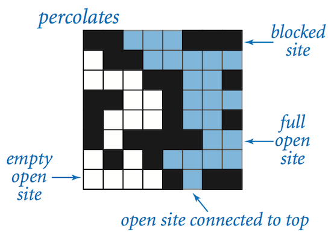
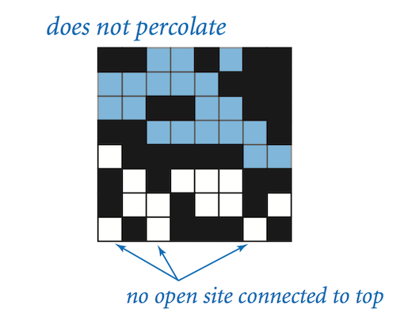
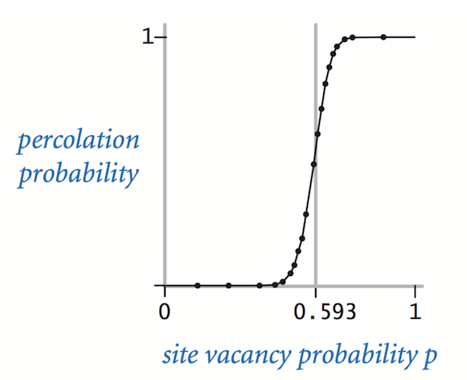
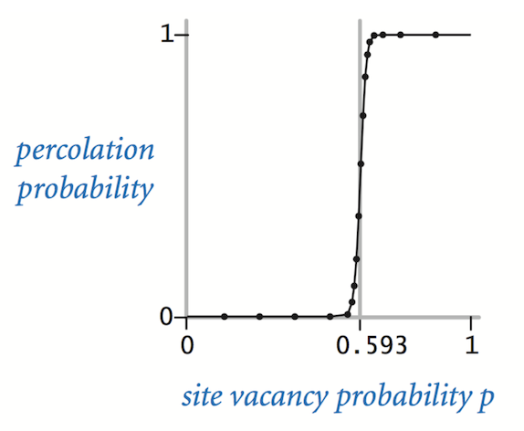
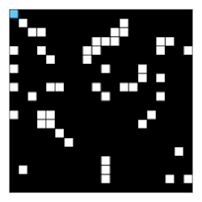
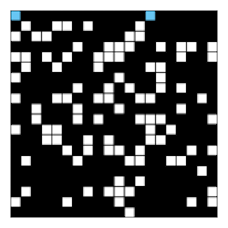
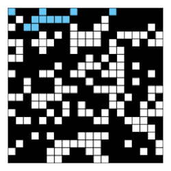
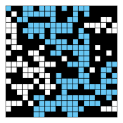
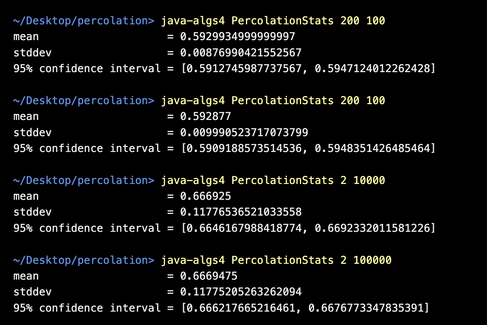

# Coursera Week 1 Percolation Project `DSp5Percolation`

## IMPORTANT
Although you may also use a two-dimensional array for this project,
you **must** use the provided Union-Find structure, which is described
in the Week 1 Coursera videos, and available in the `algs4.jar` file,
the `WeightedQuickUnionUF` class (imported at the top of `Percolation`).

## Assignment Specification
http://coursera.cs.princeton.edu/algs4/assignments/percolation.html

## Checklist
https://coursera.cs.princeton.edu/algs4/assignments/percolation/faq.php

## Project Overview
Write a program to estimate the value of the **percolation threshold** via 
Monte Carlo simulation.

## Percolation
Given a composite system comprised of randomly distributed insulating 
and metallic materials: what fraction of the materials need to be metallic 
so that the composite system is an electrical conductor? Given a porous 
landscape with water on the surface (or oil below), under what conditions 
will the water be able to drain through to the bottom (or the oil to gush 
through to the surface)? Scientists have defined an abstract process known 
as **percolation** to model such situations.

## The Model
We model a percolation system using an *n*-by-*n* grid of **sites**. Each site is
either **open** or **blocked**. A **full** site is an open site that can be connected
to an open site in the top row via a chain of neighboring (left, right, up, down)
open sites. We say the system **percolates** if there is a full site in the bottom row.
In other words, a system percolates if we fill all open sites connected to the
top row and that process fills some open site on the bottom row. (For the
insulating/metallic materials example, the open sites correspond to metallic
materials, so that a system that percolates has a metallic path from top to bottom,
with full sites conducting. For the porous substance example, the open sites
correspond to empty space through which water might flow, so that a system that
percolates lets water fill open sites, flowing from top to bottom.)

## The Problem
In a famous scientific problem, researchers are interested in the following
question: if sites are independently set to be open with probability *p*
(and therefore blocked with probability *1 − p*), what is the probability
that the system percolates? When *p* equals *0*, the system does not percolate;
when *p* equals *1*, the system percolates. The plots below show the site
vacancy probability *p* versus the percolation probability for 20-by-20 random
grid (left) and 100-by-100 random grid (right).

When *n* is sufficiently large, there is a threshold value _p\*_ such that when
_p \< p\*_ a random *n*-by-*n* grid almost never percolates, and when _p \> p\*_,
a random *n*-by-*n* grid almost always percolates. No mathematical solution for
determining the percolation threshold _p\*_ has yet been derived. Your task is
to write a computer program to estimate _p\*_.

## Percolation Data Type
To model a percolation system, create a data type `Percolation` with the following API:

    public class Percolation {
        // creates n-by-n grid, with all sites initially blocked
        public Percolation(int n)
    
        // opens the site (row, col) if it is not open already
        public void open(int row, int col)
    
        // is the site (row, col) open?
        public boolean isOpen(int row, int col)
    
        // is the site (row, col) full?
        public boolean isFull(int row, int col)
    
        // returns the number of open sites
        public int numberOfOpenSites()
    
        // does the system percolate?
        public boolean percolates()
    
        // test client (optional)
        public static void main(String[] args)
    }

### Corner Cases
By convention, the row and column indices are integers between 1 and *n*,
where (1, 1) is the upper-left site: Throw an `IllegalArgumentException`
if any argument to `open()`, `isOpen()`, or `isFull()` is outside its
prescribed range. Throw an `IllegalArgumentException` in the constructor
if *n* ≤ 0.

### Performance Requirements
The constructor must take time proportional to *n2*; all instance methods
must take constant time plus a constant number of calls to `union()` and `find()`.

## Monte Carlo Simulation
To estimate the percolation threshold, consider the following computational
experiment:

- Initialize all sites to be blocked.
- Repeat the following until the system percolates:
    - Choose a site uniformly at random among all blocked sites.
    - Open the site.
- The fraction of sites that are opened when the system percolates provides
an estimate of the percolation threshold.

For example, if sites are opened in a 20-by-20 lattice according to the
snapshots below, then our estimate of the percolation threshold is
204/400 = 0.51 because the system percolates when the 204th site is opened.

By repeating this computation experiment *T* times and averaging the results,
we obtain a more accurate estimate of the percolation threshold. Let *x\_t* be
the fraction of open sites in computational experiment *t*. The sample mean
*x-bar* provides an estimate of the percolation threshold; the sample standard
deviation *s* measures the sharpness of the threshold.

Assuming *T* is sufficiently large (say, at least 30), the following provides
a 95% confidence interval for the percolation threshold:

To perform a series of computational experiments, create a data type
`PercolationStats` with the following API.

    public class PercolationStats {
        // perform independent trials on an n-by-n grid
        public PercolationStats(int n, int trials)
    
        // sample mean of percolation threshold
        public double mean()
    
        // sample standard deviation of percolation threshold
        public double stddev()
    
        // low endpoint of 95% confidence interval
        public double confidenceLo()
    
        // high endpoint of 95% confidence interval
        public double confidenceHi()
    
        // test client (see below)
        public static void main(String[] args)
    }

Throw an `IllegalArgumentException` in the constructor if either *n* ≤ 0
or *trials* ≤ 0.

Also, include a `main()` method that takes two **command-line arguments** *n*
and *T*, performs *T* independent computational experiments (discussed above)
on an *n*-by-*n* grid, and prints the sample mean, sample standard deviation,
and the 95% **confidence interval** for the percolation threshold. Use
[StdRandom](https://algs4.cs.princeton.edu/code/javadoc/edu/princeton/cs/algs4/StdRandom.html)
to generate random numbers; use
[StdStats](https://algs4.cs.princeton.edu/code/javadoc/edu/princeton/cs/algs4/StdStats.html)
to compute the sample mean and sample standard deviation.

## Analysis of Running Time and Memory Usage (optional)
Implement the `Percolation` data type using the quick find algorithm in
[QuickFindUF](https://algs4.cs.princeton.edu/code/javadoc/edu/princeton/cs/algs4/QuickFindUF.html).

- Use [Stopwatch](https://algs4.cs.princeton.edu/code/javadoc/edu/princeton/cs/algs4/Stopwatch.html)
to measure the total running time of `PercolationStats` for various values
of *n* and *T*. How does doubling *n* affect the total running time? How does
doubling *T* affect the total running time? Give a formula (using tilde notation)
of the total running time on your computer (in seconds) as a single function
of both *n* and *T*.
- Using the 64-bit memory-cost model from lecture, give the total memory usage
in bytes (using tilde notation) that a `Percolation` object uses to model an
*n*-by-*n* percolation system. Count all memory that is used, including memory
for the union–find data structure.

Now, implement the `Percolation` data type using the weighted quick union
algorithm in `WeightedQuickUnionUF`. Answer the questions in the previous paragraph.

## Project Submission
Your submission may not call library functions except those in
[StdIn](https://algs4.cs.princeton.edu/code/javadoc/edu/princeton/cs/algs4/StdIn.html),
[StdOut](https://algs4.cs.princeton.edu/code/javadoc/edu/princeton/cs/algs4/StdOut.html),
[StdRandom](https://algs4.cs.princeton.edu/code/javadoc/edu/princeton/cs/algs4/StdRandom.html),
[StdStats](https://algs4.cs.princeton.edu/code/javadoc/edu/princeton/cs/algs4/StdStats.html),
[WeightedQuickUnionUF](https://algs4.cs.princeton.edu/code/javadoc/edu/princeton/cs/algs4/WeightedQuickUnionUF.html),
and `java.lang`.

## For Fun
Create your own percolation input file and share it with the class.
For some inspiration, do an image search for “nonogram puzzles solved.”

## Tips
1. Do not write your own union-find data structure. Use `WeightedUnionQuickUnionUF` instead.
2. It is ok to use an extra row and/or column to deal with the 1-based indexing of the percolation grid.
3. Each of the methods in `Percolation` must use a constant number of union-find operations.
4. You need to map the 2D coordinate pair to a 1D union-find object index.
5. Consider using a private method for validating indices.

## Implementation Reminder
This is mostly for Mr Young, but maybe it will help you as well. To get everything
working, you need to have the following line in the `build.gradle.kts` file.

`implementation(files("libs/algs4.jar"))`

